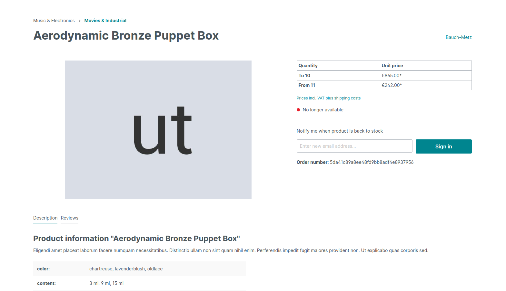
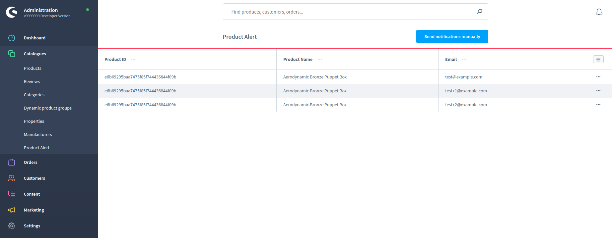
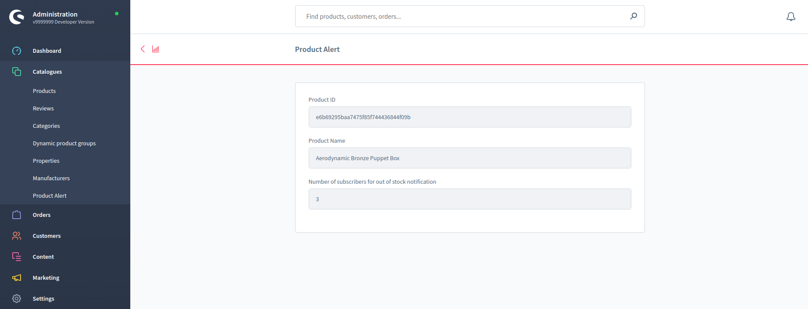
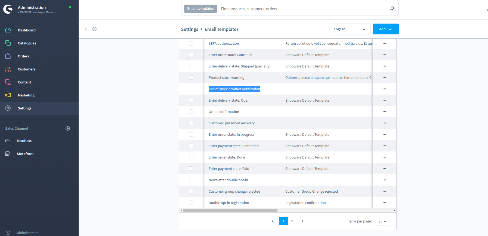

# Product Alert extension

This extension provides the functionality of "Out of stock notification".

If a product is out of stock, a user can sign to product alert notification which sends an email when this product is back to stock


## Table of content

* [Documentation](#documentation)
* [Setup](#setup)
* [Tests](#tests)
* [Licensing](#licensing)
* [About the Author](#about-the-author)

## Documentation

### Features
- New form for customers who want to sign for notification when the product will back to stock
- A grid in admin panel with a list of subscribers and products
- Details how many subscribers are signed for a specific product
- Customizable email template
- The scheduled task for sending notifications (every 24 hours)
- Button in the admin panel which can process notifications manually

### Usage

#### Storefront
1. As a customer you can sign to product alert notification(only for out of stock products - stock = 0).

    

#### Admin panel
1. As an admin, you can view emails which are subscribed for specific product.

    

2. After clicking for some row, you can view how many subscribers are signed for this specific product(fir statistics purposes).

    

3. Also if admin wants to send notifications manually, it can be done by clicking button above grid.
   **(By default there is a scheduled task which sends notifications every 24 hours)**
    
4. Module has its own email template for notification, so admin can customize it for its needs.
    
    

#### CLI

You can use CLI command to send notifications manually
                        
```bash
$ bin/console product:alert:send
```

### Compatibility
This plugin is compatible with Shopware 6.2

## Setup

### Downloading plugin
#### Using Composer (recommended)
Run `composer require divante/product-alert` in your project root directory
#### Copying files
Copy files from this repository (you can clone it or download as zip) to `<root>/custom/plugins/DivanteProductAlert`
### Installation

Refresh plugin list

```bash
$ bin/console plugin:refresh
```

Install and activate the plugin

```bash
$ bin/console plugin:install --activate DivanteProductAlert
```

Clear the cache (sometimes invalidation is needed for the new routes to activate)

```bash
$ bin/console cache:clear
```
        
## Tests

Tests are located in `tests/` and configured in `phpunit.xml` in each folder.

In order to run the tests you have to set up the test database so that Shopware runs them with our plugin enabled.

After the plugin is installed in your shop, make sure you execute the follwing command (in the Shopware root directory) to dump the current configuration of your shop to the test-database (when using Docker, run it inside the container):

```bash
$ ./psh.phar init-test-databases
```

Then execute the following commands in the plugin's root directory to run the test.

```bash
$ composer dump-autoload
$ ../../../vendor/bin/phpunit
```
## Licensing
The code in this project is licensed under the MIT license.

## About the Author
This plugin has been created by Divante eCommerce Software House.


We are a leading, global eCommerce solution partner, headquartered in Poland with more than 250 people on board. 
Our essential business Partners are Magento, SAP, Shopware, Pimcore, commercetools, Vue.js, Symfony, to list just a few.
We believe in Open Source. That's why we build vibrant communities of employees, contributors, clients,
advisors as an ecosystem around exceptional products and services.
 
It enables us to deliver the expected effects of projects quickly and in an agile way, making it easier for clients
to gain a competitive advantage. Our clients are present and future leaders of their industries, perceiving technology
as a key ingredient to the success of their company.

For more information, please visit [Divante.com](https://divante.com).
